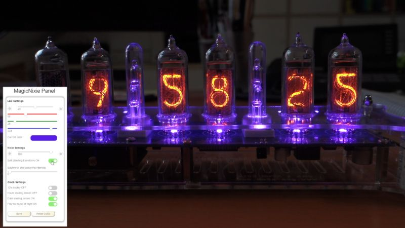

# MagicNixie

Firmware to use the GRA &amp; AFCH IN-14 Arduino Shield Nixie Tubes Clock modified to use a Wemos D1 WiFi Arduino-compatible board with ESP8266.

[Video to demonstrate the firmware](https://youtu.be/gqnWdiJaWJw)

## Features
* WiFi connected through ESP8266
* Showing time, date, temperatures
* PWM for Nixie blending and fading
* Full-color LED control
* Web interface
* Using NTP for time/date sync
* Using MQTT for temp updates, configuration and logging
* Sound and music output support
* Modular PlatformIO project for ESP8266
* Arduino library management (portable)
* Multitasking scheduler
* 1 MHz SPI and 1 kHz shift register updates allow PWM for brightness control and blending effects
* WiFi manager integrated (easy set up)
* Control and configure through MQTT and web interface
* RTC support (backup)
* Logging output UART + MQTT
* Light sensor support (prepared)

## Hardware references
[Schematics for the NCS314 Nixie shield that was used for the modification, version 3.4](http://gra-afch.com/content/uploads/2020/12/Scheme-Shield-NCS314-6-v3.4.pdf)

[WeMos D1 R2 Board Schematic](https://www.openhacks.com/uploadsproductos/wemos-d1-r2-schematic.pdf)

[WeMos D1 R2 Pinout](https://www.elkim.no/wp-content/uploads/2021/06/PINOUT0G-00005444WIFI-D1R2-ESP8266.pdf)

[Arduino Uno Pinout](https://diyi0t.com/wp-content/uploads/2019/08/Arduino-Uno-Pinout-1.png)

## Modifying Nixie Clock Shield NCS314 for the use with WeMos D1 R2 board
The ESP8266 on the WeMos D1 R2 has a lot fewer I/O pins than the typical ATmega on the standard Arduino board so several pins are connected to the same signals and can't be used independently from each other. The most important signals are individually accessible, though. Following table shows how the signals are connected in the respective boards:

|NCS314|Arduino|WeMos D1 R2|ESP8266|
|------|-------|-----------|-------|
|SDA   |SDA    |D2         |GPIO4  |
|SCL   |SCL    |D1         |GPIO5  |
|SCK   |D13    |D5         |GPIO14 |
|MOSI  |D11    |D7         |GPIO13 |
|LE    |D10    |D8         |GPIO15 |
|PWM1  |D6     |D4         |GPIO2  |

## Conflicts
Older versions of NCS314 had PWM2 and PWM3 signals that together with with PWM1 controlled the red/green/blue LEDs for illumination but here, only PWM1 is used to control all individually addressable SK6812-Mini LEDs together. The only remaining conflict is the IR signal on the Arduino D2 pin which is connected to D14 and SDA. To resolve this, I had to isolate the D2 pin on the WeMos. Alternatively, one can also remove the IR receiver on the Nixie shield.
Arduino-D1/GPIO1 (Tx) is connected to the debugging USB UART and to the optional GPS module. Right now this would be a conflict even with no GPS module connected.

## Free signals
The only available unused signal is D6/GPIO12 (MISO). We could wire this to the shield's IR signal if we needed remote support.

## Building and Using
* [Install PlatformIO](https://platformio.org/install)
* Clone the repository, open it in PlatformIO
* Edit config.h and platformio.ini to make adjustments for your network environment and hardware
* Build and download the firmware to the WeMos D1 R2 board
* Enjoy (if it works) or curse (if it doesn't) ;-)

The firmware outputs extensive logging information to the debug UART which you can use to diagnose problems
